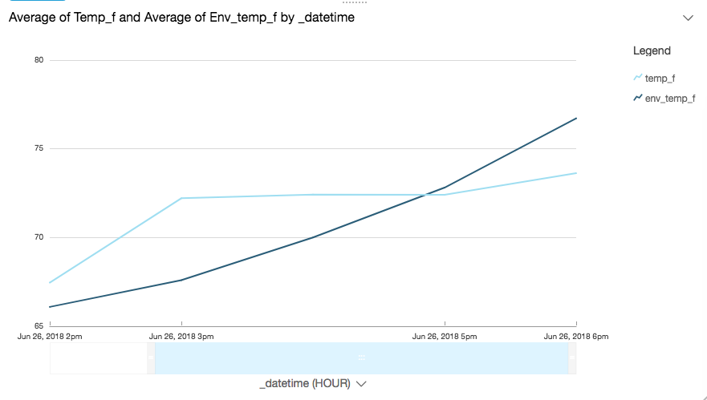

# AWS IoT Analytics

aws-iot-analytics is a sample project that explores [AWS IoT Analytics](https://aws.amazon.com/iot-analytics/). The goal is to build a Raspberry Pi-based device capable of transmitting current environment data (e.g. temperature, humidity) to AWS IoT, where IoT Analytics will enrich that data with current weather. The enriched data will then be fed to AWS QuickSight to create a simple visualization.

This project requires a [Raspberry Pi 3](https://www.raspberrypi.org/) as well as a [Sense HAT](https://www.raspberrypi.org/products/sense-hat/) add-on. Total cost is approximately $100 for hardware.

## Getting Started

To get started, clone this repository locally:

$ git clone https://github.com/jkahn117/aws-iot-analytics-sample.git

The repository contains an AWS CloudFormation template that will launch the needed AWS resources as well as source code for the sample.

### Prerequisites

To run the aws-iot-analytics-sample project, you will need to:

1. Select an AWS Region into which you will deploy services. Be sure that all required services (specifically AWS IoT Analytics) are available in the Region you select.
2. Confirm your [installation of the latest AWS CLI](http://docs.aws.amazon.com/cli/latest/userguide/installing.html).
3. Confirm the [AWS CLI is properly configured](http://docs.aws.amazon.com/cli/latest/userguide/cli-chap-getting-started.html#cli-quick-configuration) with credentials that have administrator access to your AWS account.
4. [Install Node.js and NPM](https://docs.npmjs.com/getting-started/installing-node).

## Deployment

Deploying this project is broken down into five sections, each covering an indepdent aspect of the solution. Please move through them in order:

1. [Part 1: Deploying AWS Resources](./docs/1_aws_resources.md)
2. [Part 2: Configuring AWS IoT Core](./docs/2_iot_core.md)
3. [Part 3: Setting up your Raspberry Pi](./docs/3_)
4. [Part 4: Enriching Data with AWS Iot Analytics](./docs/4_)
5. [Part 5: Visualizing Data with AWS Quicksight](./docs/5_)

At the end of the project, you will have create a live dashboard in AWS Quicksight that displays environmental conditions around the Raspberry Pi relative to the outside:

Please feel free to provide feedback on this project.

## Authors

* **Josh Kahn** - initial work
