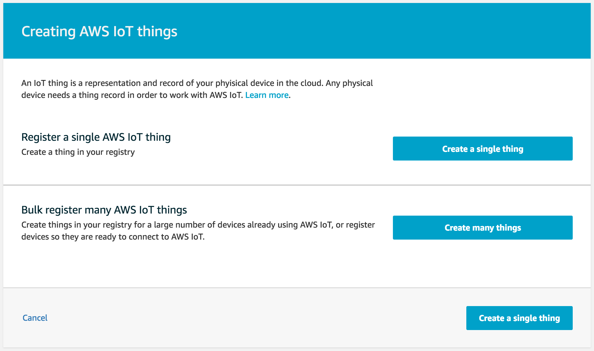
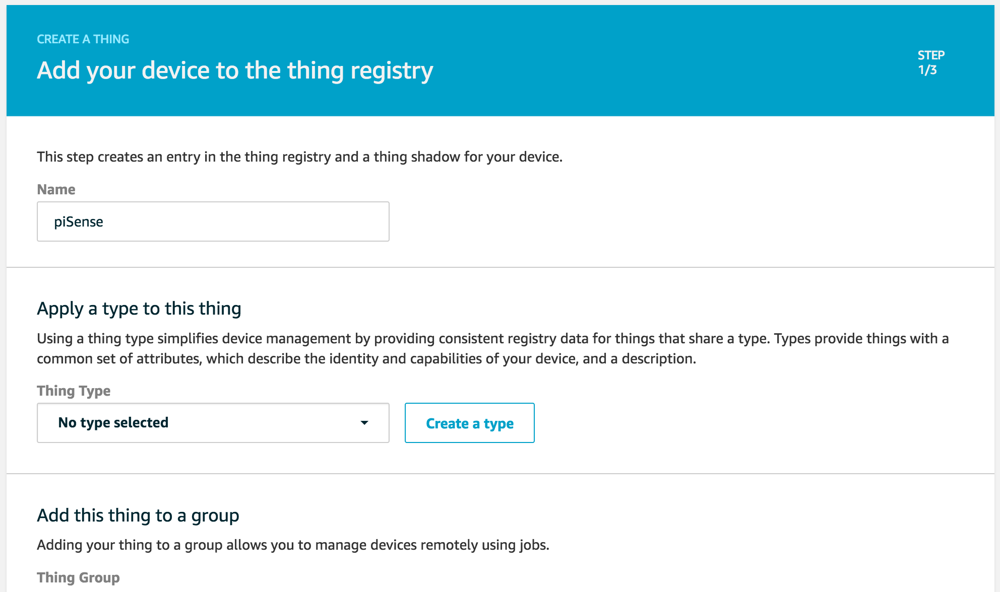
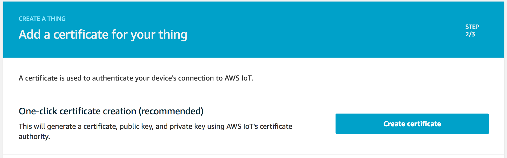
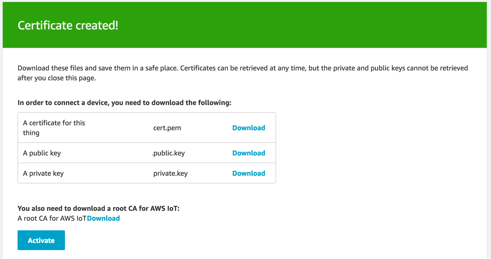
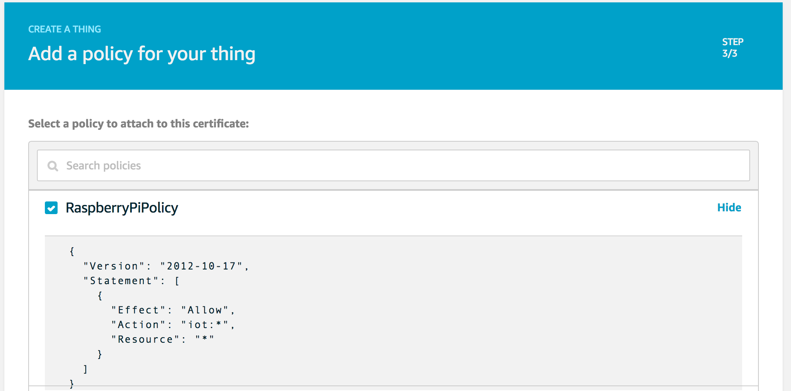

# AWS IoT Analytics

## Part 2: Configuring AWS IoT Core

Before we setup AWS IoT Analytics, we need to setup our Raspberry Pi as a device in AWS IoT Core.

Begin by opening the AWS IoT Core console. Select "Manage" > "Things" in the menu on the left. Then select "Create" in the upper right corner.

On the subsequent page, select "Create a single thing".

Provide a unique name for your Thing (e.g. "piSense") and select "Next" at the bottom of the page.

Next, create a certificate via "One-click certificate creation" by clicking the "Create Certificate" button.

Once your certificate has been created, download the Thing certificate as well as the public and private keys (yes, you need to click download three times). Before you leave this page, also download the root CA for AWS IoT, found at the bottom of the page.

After downloading four files, click the "Activate" button.

Finally, select the policy we created earlier and click "Register Thing" at the bottom of the page.

We can now begin to setup our Raspberry Pi device.

[Next: Configuring AWS IoT Core](3_raspberry_pi.md)
